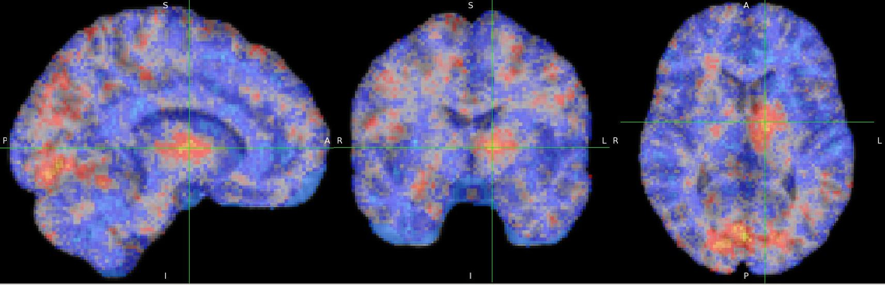

# mvpa — Machine Learning from fMRI

This repository contains a machine learning pipeline that decodes gaze direction from fMRI brain activity recorded while participants explored a virtual environment. Using multi-voxel pattern analysis (MVPA) and searchlight-style models, the pipeline predicts the direction a person was looking from their brain responses.

## Results example

^ The algorithm systematically scans the entire brain in small spheres of voxels. The pattern of activity in each sphere of voxels is used to try to predict heading direction. The voxels for which the prediction is most accurate are in red/yellow - i.e. - that is where head direction information is encoded.

The core analyses train and evaluate classifiers/regressors on brain activity features (beta images), use Leave-One-Group-Out cross-validation, and report held-out decoding performance — this is supervised machine learning applied to neuroimaging.

## Project layout
- `main.py` — Main analysis pipeline . It orchestrates preprocessing, beta image generation, model training, cross-validation, and results aggregation.
- `compute_beta_images.py` — Convert first-level GLM results into beta images used as features for decoding.
- `file_path_manager.py` — Centralize dataset and output paths (edit before running).
- `requirementsMVPA.txt` — Python dependencies.

### Notes & data privacy
- This work requires raw fMRI/behavioral data that cannot be shared publicly due to participant privacy. The code can be run with your own (appropriately consented and preprocessed) datasets.

### License
This repository is available under the MIT License (see LICENSE).
